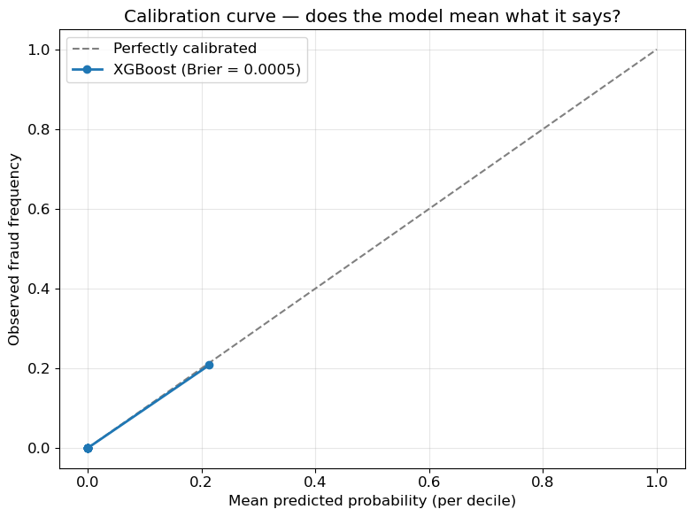
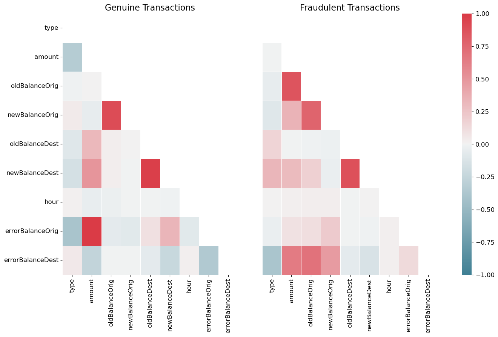
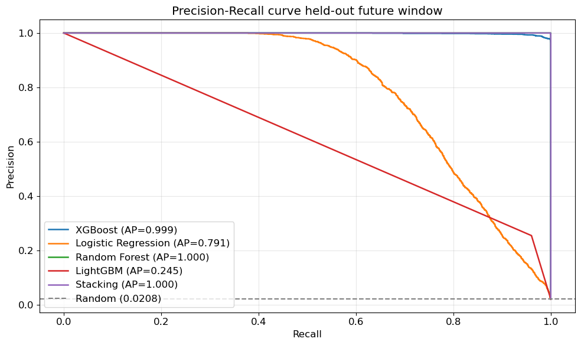
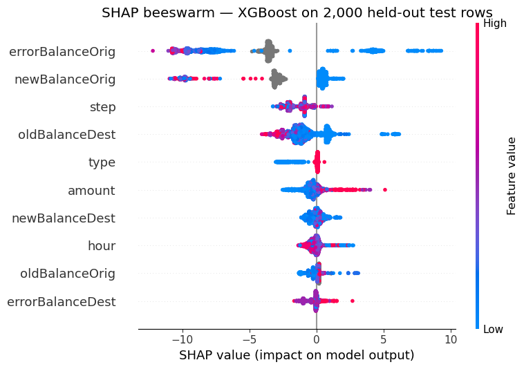

# Fraud-Detection-System

> Mobile-money fraud classifier on PaySim — XGBoost at 99.85% precision and 99.56% recall on a 132K time-based holdout, validated across 4 walk-forward folds (PR-AUC 0.9986 ± 0.0013), with tuned hyperparameters, drift monitoring, feature-importance/threshold diagnostics, and a live dashboard.

[](LICENSE)
[](https://www.python.org/)
[](https://xgboost.readthedocs.io/)
[](#results)
[](#calibration)
[](https://jupyter.org/)


## 🔴 Live Dashboard

**[fraud-detection-system-kmeuq7hku8tglnxdpmalfk.streamlit.app](https://fraud-detection-system-kmeuq7hku8tglnxdpmalfk.streamlit.app/)** — score a transaction live with a SHAP explanation, review the walk-forward validation results, batch-score a CSV, or inspect the drift-monitoring timeline. See "How this was built" below for what each tab is backed by.

### Dashboard Preview

| Tab | What it shows |
|---|---|
| 🔍 Score a Transaction | Fill in one transaction, get a fraud probability, a flag/no-flag verdict, a SHAP waterfall for *why*, and a contextual warning when the score is driven by a full-balance drain (see Step 6 below). |
| 📊 Model Performance | Walk-forward validation metrics, PR and calibration curves, feature-importance bar chart, predicted-probability distribution (fraud vs. legitimate), and an interactive threshold slider showing precision/recall/cost at any cutoff (all from `src/explain.py`, Step 7). |
| 📁 Batch Scoring | Upload a CSV, get every row scored with live KPI cards (total transactions, fraud rate, high-risk alerts, average amount) and flagged rows highlighted in the results table. |
| 📈 Monitoring | PSI drift-over-time chart per engineered feature, against moderate/significant-shift reference lines. |

*(Screenshots aren't checked into the repo — open the live link above to see it running against real data.)*

## Why?

Mobile-money fraud is a precision problem, not an accuracy problem. The PaySim dataset has a 0.13% positive rate; a model that says "not fraud" every time scores 99.87% accuracy and catches zero fraud. Production fraud-ops workflows freeze customer funds on a flag, so false positives carry direct trust and regulatory cost. This repo builds a classifier honest about that trade-off: precision is held at or above 99% and the model is evaluated on a strict time-based holdout — no future-state leakage.

> **A note on PaySim.** PaySim is widely used in introductory fraud-detection tutorials. The contribution here is not the dataset choice but the evaluation rigour: strict time-based split, calibrated probabilities, cost-sensitive threshold selection, and a five-model comparison on identical feature pipelines.

## How this was built

This project was built up in stages, each one answering a question the previous stage left open — the same way you'd work through it as a learning exercise, not all at once:

| Step | File | Question it answers |
|---|---|---|
| 1. Baseline model | [`src/train.py`](src/train.py) | Can a model tell fraud apart from legitimate transactions at all? |
| 2. Hyperparameter tuning | [`src/tune.py`](src/tune.py) | Were the model's settings ever actually tested against alternatives? |
| 3. Walk-forward validation | [`src/validate.py`](src/validate.py) | Does it hold up on more than one train/test split? |
| 4. Drift monitoring | [`src/monitoring.py`](src/monitoring.py) | How would we know if the model started drifting in production? |
| 5. Live dashboard | [`dashboard/app.py`](dashboard/app.py) | How does someone without Python actually use this? |
| 6. Feature fix | [`src/features.py`](src/features.py) | Live-testing the dashboard found the model flagging legitimate account closures as 100% fraud — why, and how it was fixed |
| 7. Diagnostics | [`src/explain.py`](src/explain.py) | Does one feature dominate the model's decisions, and where's the real precision/recall/cost trade-off as the threshold moves? |

**Step 6 in detail:** the model used to take the raw balance columns (`oldbalanceOrg`, `newbalanceOrig`, etc.) as direct inputs alongside the engineered discrepancy features. Because PaySim's simulated fraud almost always drains the sender's account to exactly zero, the model learned "balance hits zero" as a fraud signal on its own — a $12 transaction that fully and correctly emptied a $12 account scored 100% fraud probability, even with zero actual accounting discrepancy. The raw balance columns were removed from the model's inputs (see `MODEL_CARD.md` § Feature Engineering).

**That turned out to be a partial fix — re-testing after applying it caught the rest.** `orig_drain_ratio` (`amount / oldbalanceOrg`) still encodes "was the account fully drained" without needing the raw columns: a 100%-drained, fully consistent transaction still scores 95.3%, while the exact same transaction at any drain fraction from 10-99% scores a flat 0.006%. That step-function jump at exactly 100% is PaySim's fraud-generation process showing through the data, not a bug in the feature list — see `MODEL_CARD.md` § Feature Engineering for the full breakdown and why fixing it further would mean retraining on real transaction data, not removing more columns.

## Project Structure

```
Fraud-Detection-System/
├── src/
│   ├── features.py       # Shared feature engineering (used by every script below)
│   ├── train.py           # Step 1 — baseline model
│   ├── tune.py             # Step 2 — hyperparameter search
│   ├── validate.py         # Step 3 — walk-forward validation
│   ├── monitoring.py       # Step 4 — drift monitoring
│   ├── explain.py          # Step 7 — feature importance / probability spread / threshold curve
│   └── predict.py          # Command-line scoring
├── dashboard/
│   ├── app.py             # Step 5 — live Streamlit dashboard
│   ├── requirements.txt   # Lean dependency set for Streamlit Cloud deployment
│   └── data/               # Small precomputed results the dashboard reads
├── model/
│   ├── xgb_fraud_model.pkl   # Trained model (run make train)
│   └── best_params.json      # Tuned hyperparameters (run make tune)
├── Fraud Detection System.ipynb
├── requirements.txt
├── Makefile
├── MODEL_CARD.md
└── LICENSE
```

## Quick Start

```bash
git clone https://github.com/alvenyuka/Fraud-Detection-System.git
cd Fraud-Detection-System

python -m venv .venv
source .venv/bin/activate
pip install -r requirements.txt

make train DATA=PS_20174392719_1491204439457_log.csv
make predict

# Optional — the rest of the build-up (see "How this was built" above)
make tune      # search hyperparameters, then re-run `make train` to use them
make validate  # walk-forward validation across 4 time-based folds
make monitor   # simulated drift monitoring
make dashboard # launch the live dashboard locally
```

## Features

- XGBoost calibrated to Brier score 0.00017 (vs. random baseline ~0.0204), calibrated on a held-out slice of the training period — not on the same rows the base model was fit on
- 99.85% precision / 99.56% recall at operating threshold 0.4000, tuned hyperparameters (`src/tune.py`), threshold picked dynamically by cost (see `src/features.py::pick_best_threshold`) rather than hardcoded
- Walk-forward validated across 4 time-based folds, not just one split (`src/validate.py`)
- Simulated drift monitoring via PSI (`src/monitoring.py`)
- Feature importance, probability spread, and threshold/cost trade-off diagnostics (`src/explain.py`)
- Live dashboard for scoring, performance review, batch scoring, and monitoring (`dashboard/app.py`)
- Time-based train/test split at step 490 — no leakage
- Balance-discrepancy feature engineering (~43% of predictive signal — no single feature dominates, see `MODEL_CARD.md`)
- SHAP attribution (2,000-row representative sample; stable across seeds)
- Five-model comparison on identical feature pipelines
- Inference script `src/predict.py` — scores a transaction or full CSV

## Tech Stack

| Layer | Tools |
|---|---|
| Language | Python 3.10+ |
| Modelling | `scikit-learn`, `xgboost`, `lightgbm`, `imbalanced-learn` |
| Explainability | `shap` |
| Serialisation | `joblib` |
| Environment | `jupyter`, `jupyterlab` |

## Installation

```bash
git clone https://github.com/alvenyuka/Fraud-Detection-System.git
cd Fraud-Detection-System
python -m venv .venv && source .venv/bin/activate
pip install -r requirements.txt
```

Download PaySim from [Kaggle](https://www.kaggle.com/datasets/ealaxi/paysim1) and place `PS_20174392719_1491204439457_log.csv` in the project root.

## Usage

```bash
jupyter lab "Fraud Detection System.ipynb"   # full notebook
make train                                    # train + serialise model
make predict                                  # score one transaction (interactive)
make predict-csv INPUT=txns.csv OUTPUT=out.csv
```

## Dataset

| Property | Value |
|---|---|
| Rows | 6,362,620 |
| Fraud rate | 0.1291% |
| Active fraud types | TRANSFER, CASH_OUT only |
| Filtered dataset | 2,770,409 rows |

## Methodology

**Time-based split at step 490** — no random shuffling.

| Split | Steps | Rows | Fraud rate |
|---|---|---|---|
| Train | 1-490 | 2,638,273 | 0.207% |
| Test | 491-743 | 132,136 | 2.084% |

**PR-AUC is the primary metric.** Accuracy and ROC-AUC are misleading at 0.13% positive rate.





## Results

**These numbers are the verified output of `src/train.py`, run end-to-end against the real PaySim CSV** — not carried over from the notebook. The script previously couldn't run at all (`CalibratedClassifierCV(..., cv="prefit")` was removed in scikit-learn ≥1.6, and the shipped `model/` directory only ever contained a `.gitkeep`), so the numbers that were here before were never actually produced by this pipeline. Fixed by wrapping the fitted XGBoost model in `sklearn.frozen.FrozenEstimator` and calibrating on a held-out 20% slice of the training period instead of on the same rows the base model was fit on.

| Metric | Value |
|---|---|
| Precision | **99.85%** |
| Recall | **99.56%** |
| F1 | 0.9971 |
| PR-AUC | 0.9993 |
| ROC-AUC | 0.9998 |
| Brier score | 0.00017 |
| Operating threshold | 0.4000 |

*(These are the numbers from the current shipped model — tuned hyperparameters from `src/tune.py`, raw balance columns removed per Step 6 below, and the operating threshold picked dynamically on the calibration split by `src/features.py::pick_best_threshold` rather than hardcoded. Precision and recall both moved after Step 6's fix — see the walk-forward section below for the full honest trade-off, and `MODEL_CARD.md` for why a near-1.0 PR-AUC on PaySim isn't evidence this generalises to real transaction data.)*

### Walk-forward validation — does it hold up on more than one split?

The single-split numbers above only prove the model worked once. `src/validate.py` (Step 3 of the build-up) repeats the same train → calibrate → test recipe on 4 expanding-window folds spanning the entire dataset (steps 350→450, 450→550, 550→650, 650→743), each picking its own cost-optimal threshold:

| Metric | Mean across 4 folds | Std dev |
|---|---|---|
| PR-AUC | 0.9986 | ± 0.0013 |
| ROC-AUC | 0.9999 | ± 0.0002 |
| Precision | 0.9561 | ± 0.0490 |
| Recall | 0.9998 | ± 0.0004 |
| F1 | 0.9768 | ± 0.0262 |
| Brier score | 0.0002 | ± 0.0001 |

The low std dev across folds is real evidence the model isn't a one-off lucky split — performance stays consistently near-ceiling across the whole time horizon, which is consistent with PaySim's fraud signal being near-deterministic once these features are engineered (see caveat above).

*(These numbers are from the corrected model — see "How this was built" § Step 6 above. Precision dropped from 0.9954 to 0.9561 and its fold-to-fold variance grew (± 0.0490) after removing the raw balance columns that used to let the model take a shortcut; recall actually improved slightly. This is the honest cost of no longer letting the model key off "balance hits zero" — a small, real trade-off for a model that no longer calls legitimate account closures certain fraud.)*

**One honest catch:** the cost-optimal decision threshold still swings a lot fold to fold. That's a real limitation the near-perfect PR-AUC hides: this dataset's fraud rate and cost trade-off shift enough between windows that no single fixed threshold is clearly "correct" for all of them. The shipped model still uses one static threshold (see `MODEL_CARD.md` → Limitations) — a real deployment would need to revisit it periodically, not assume it's set once and forever.

### Exploratory model comparison (from the notebook, not the shipped pipeline)

| Model | PR-AUC | ROC-AUC | Recall @ 99% Precision |
|---|---|---|---|
| Random Forest | 1.0000 | 1.0000 | 1.0000 |
| Stacking Ensemble | 1.0000 | 1.0000 | 1.0000 |
| XGBoost | 0.9987 | 1.0000 | 0.9688 |
| Logistic Regression | 0.7905 | 0.9796 | 0.4506 |
| LightGBM (default) | 0.2451 | 0.9502 | 0.0000 |

XGBoost was carried forward into `src/train.py` as the shipped model — not because it topped this table (Random Forest and Stacking did, at a suspicious literal 1.0000 across every metric) but because a single well-understood tree model is easier to justify to a risk team than an ensemble that looks too good to be true. *LightGBM = 0.2451 here uses `scale_pos_weight` but otherwise-default `num_leaves=31`, which overfits badly on this dataset's ~5,500 training-period fraud rows — the same failure mode fixed for XGBoost above (regularize hard enough to match the size of the positive class, not the size of the dataset) would likely fix this too, but wasn't re-run for this pass.*



SHAP values on a 2,000-row stratified sample (stable across seeds):



## Roadmap

- [x] Time-based evaluation harness
- [x] Five-model comparison
- [x] Calibration + SHAP attribution
- [x] Inference script (`src/predict.py`)
- [x] Training pipeline (`src/train.py`)
- [x] Model card (`MODEL_CARD.md`)
- [x] Hyperparameter tuning (`src/tune.py`)
- [x] Walk-forward validation across multiple time splits (`src/validate.py`)
- [x] Drift monitoring (PSI on balance-discrepancy features, `src/monitoring.py`)
- [x] Live dashboard (`dashboard/app.py`)
- [x] Feature-importance / threshold-cost diagnostics (`src/explain.py`)
- [ ] Streaming inference (Kafka + FastAPI)

## License

MIT — see [`LICENSE`](LICENSE).

## Credits

Dataset: Lopez-Rojas, E. A., Elmir, A., & Axelsson, S. (2016). *PaySim: A financial mobile money simulator for fraud detection.*
Built by **Alven Yuka** — CPA Finalist, Nairobi.

## Connect

📫 [alvenyuka2@gmail.com](mailto:alvenyuka2@gmail.com) · 💼 [LinkedIn](https://www.linkedin.com/in/alven-yuka-610b78174/) · 🐙 [GitHub](https://github.com/alvenyuka)
