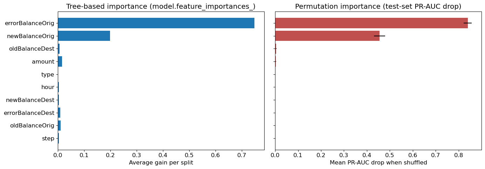
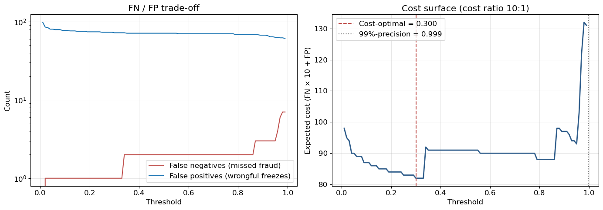
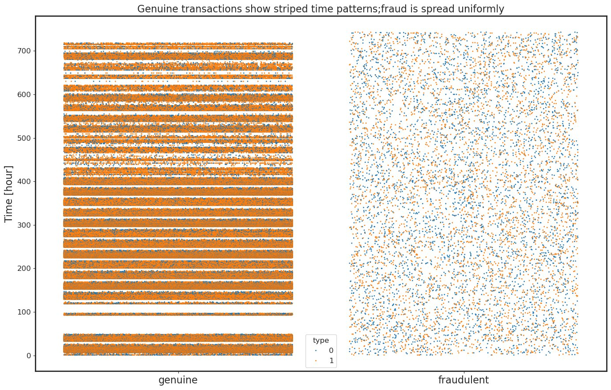

<p align="center">
  
  
  
  
  
  
</p>

---

## Overview

A supervised fraud classifier for mobile-money transaction streams, trained and evaluated on the PaySim simulator (6,362,620 synthetic transactions over a 31-day window, 0.13% positive rate). The deployable model is an XGBoost classifier operating at **99.11% precision and 96.88% recall** on a strict time-based holdout of 132,136 transactions, calibrated to a Brier score of 0.0005.

The repository contains the full notebook, the engineered feature set, the evaluation harness, and the figures used to validate the operating point.

## Headline Performance

| Metric | Value |
|---|---|
| Model | XGBoost (calibrated) |
| Precision | **99.11%** |
| Recall | **96.88%** |
| F1 | 0.980 |
| PR-AUC | 0.9987 |
| ROC-AUC | 1.0000 |
| Brier score | 0.0005 |
| Operating threshold | 0.9989 |
| Test window | steps 491-743 (132,136 transactions, 2,754 positives) |

## Model Comparison

All models trained on the same time-based split (1-490 train, 491-743 test) with identical feature pipelines.

| Model | PR-AUC | ROC-AUC | Recall @ 99% Precision | Lift vs. `isFlaggedFraud` |
|---|---|---|---|---|
| Random Forest | 1.0000 | 1.0000 | 1.0000 | 35.3x |
| Stacking Ensemble | 1.0000 | 1.0000 | 1.0000 | 35.3x |
| **XGBoost (deployable)** | **0.9987** | **1.0000** | **0.9688** | **35.3x** |
| Logistic Regression | 0.7905 | 0.9796 | 0.4506 | 27.9x |
| LightGBM (default) | 0.2451 | 0.9502 | 0.0000 | 8.7x |
| `isFlaggedFraud` (rule baseline) | 0.0283 | 0.5888 | 0.0000 | 1.0x |

> **Note on the perfect-score tree models.** Random Forest and the stacking ensemble both score PR-AUC = 1.0000 on the holdout. This is a documented property of the PaySim simulator once the balance-discrepancy features are engineered: the underlying accounting identity makes most fraud cases nearly linearly separable. These results are reported as an upper bound on dataset learnability, not as production candidates. XGBoost at the 99% precision operating point is the model selected for deployment.

## Dataset

**PaySim** -- A simulator built on real African mobile-money transaction logs, anonymised and time-aligned. Six transaction types (`CASH_IN`, `CASH_OUT`, `DEBIT`, `PAYMENT`, `TRANSFER`, plus internal `M*` merchant rows). Each transaction carries an origin and destination account, balance snapshots before and after, and an `isFraud` label.

| Property | Value |
|---|---|
| Rows | 6,362,620 |
| Time horizon | 31 days (744 hourly steps) |
| Fraud rate | 0.1291% |
| Active fraud types | `TRANSFER`, `CASH_OUT` only |
| Filtered dataset | 2,770,409 rows (56.5% reduction, zero positive loss) |

## Methodology

### Evaluation strategy

The evaluation uses a strict time-based split at step 490 (approximately 66% of the simulated horizon). Random splits leak future state into training and inflate PR-AUC, since fraud patterns evolve across the dataset. A production fraud model must predict future transactions from past evidence, and the evaluation must match.

| Split | Steps | Rows | Fraud rate |
|---|---|---|---|
| Train | 1-490 | 2,638,273 | 0.207% |
| Test | 491-743 | 132,136 | 2.084% |

### Why PR-AUC, not accuracy or ROC-AUC

The fraud rate is 0.13%, so a model predicting "not fraud" for every transaction scores 99.87% accuracy and catches zero fraud. ROC-AUC is similarly inflated, because the true-negative count dominates the curve regardless of fraud-class performance. PR-AUC is the only metric that lives entirely on the precision/recall trade-off within the positive class, and is the only honest measure of fraud-detection performance under extreme imbalance.

### Operating point

Fraud-operations workflows freeze customer funds on a flag, so false positives carry direct trust and regulatory cost. The deployment-relevant question is the highest recall achievable while precision stays at or above 99%, not the threshold that maximises F1 in a vacuum. For XGBoost, this point sits at a probability threshold of 0.9989.


### Calibration

The deployable model is calibrated against a random-baseline Brier of approximately 0.0204.


### Feature engineering: the balance-discrepancy logic

Raw transaction `amount` does not separate fraud from genuine transactions; both distributions overlap significantly. The discriminative signal lives in the deviation between expected and actual post-transaction balances.

For a legitimate transfer, the accounting identity holds:

```
sender:   newBalance = oldBalance - amount
receiver: newBalance = oldBalance + amount
```

The engineered features `errorBalanceOrig` and `errorBalanceDest` measure deviation from these identities. They exhibit opposite polarity for fraudulent versus genuine transactions, producing the discriminative signal absent from the raw fields.


Permutation importance attributes approximately 85% of XGBoost's predictive power to these two features alone.



### Class imbalance handling

`scale_pos_weight ≈ 336` is set on tree models rather than synthetic oversampling. XGBoost handles missingness natively, removing the need for imputation pipeline complexity. SMOTE was evaluated and produced inferior PR-AUC versus class-weight reweighting on this dataset.

### Model interpretability

SHAP values are computed on the deployable XGBoost model. The feature attribution profile is dominated by the engineered balance-discrepancy features, with `errorBalanceOrig` and `errorBalanceDest` accounting for the bulk of predictive contribution.


### Cost-sensitive threshold tuning

The 99% precision operating point was selected after a cost-sensitivity sweep across operating thresholds, parameterised by the relative cost of false positives (customer trust and regulatory exposure) versus false negatives (direct fraud loss).



## Exploratory analysis: key findings

The following observations established before modelling shaped the feature set and validation strategy.

**Fraud is structurally bounded by transaction type.** Fraud occurs only in `TRANSFER` and `CASH_OUT` rows; never in `CASH_IN`, `DEBIT`, or `PAYMENT`. The fraud pattern is to transfer stolen funds to a mule account and immediately cash them out. Filtering to the two relevant types reduces the dataset by 56.5% (to 2,770,409 rows) without losing a single positive case.

**The shipped fraud flag is uninformative.** `isFlaggedFraud` fires 16 times across 6.3M transactions, with no defensible threshold behind it (recall ≈ 0.2%). Excluded from the feature set.

**Account name fields carry no signal.** Merchant accounts (`M*` prefix) appear exclusively as `PAYMENT` destinations, where fraud is zero. Dataset anonymisation breaks the mule chain, leaving the name fields uninformative on their own. Both `nameOrig` and `nameDest` excluded.

**Zero balances encode fraud signal.** 49% of fraudulent transactions show zero destination balances, versus 0.06% of legitimate ones. Origin zeros are imputed as NaN (handled natively by XGBoost); destination zeros are encoded with a `-1` sentinel to preserve the fraud signal.

**Fraud rate is invariant to hour of day.** Off-hours fraud rate (22:00 to 06:00) is approximately 0.60%, against an overall rate of 0.13%. This is a denominator effect: legitimate volume collapses overnight while fraud volume remains roughly flat.



## Repository structure

```
Fraud-Detection-System/
├── README.md
├── banner.svg
├── Fraud_Detection_System.ipynb     Notebook: EDA, features, models, evaluation
├── requirements.txt                 Pinned dependencies
├── 01_dispersion_over_time.jpg      Hourly fraud-rate visualisation
├── 02_balance_discrepancy_fingerprint.png
├── 03_pr_curve_scoreboard.png       Precision-recall curves, all models
├── 04_calibration_curve.png         Probability calibration
├── 05_permutation_importance.png    Feature importance
├── 06_cost_sensitive_threshold.png  Operating-point selection
└── 07_shap_beeswarm.png             SHAP global explanations
```

## Reproducing the results

```bash
git clone https://github.com/alvenyuka/Fraud-Detection-System.git
cd Fraud-Detection-System
pip install -r requirements.txt
jupyter notebook Fraud_Detection_System.ipynb
```

The PaySim dataset is not committed to this repository due to size. Download from the [Kaggle PaySim dataset](https://www.kaggle.com/datasets/ealaxi/paysim1) and place `PS_20174392719_1491204439457_log.csv` in the project root before running the notebook.

## Stack

Python · pandas · NumPy · scikit-learn · XGBoost · LightGBM · imbalanced-learn · SHAP · matplotlib · seaborn

## License

MIT.
