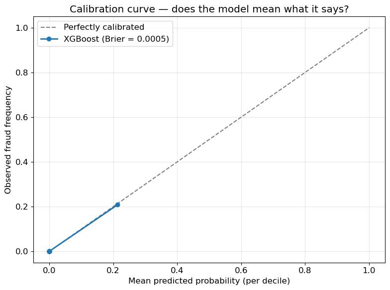
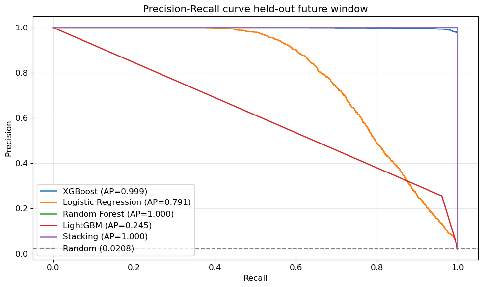
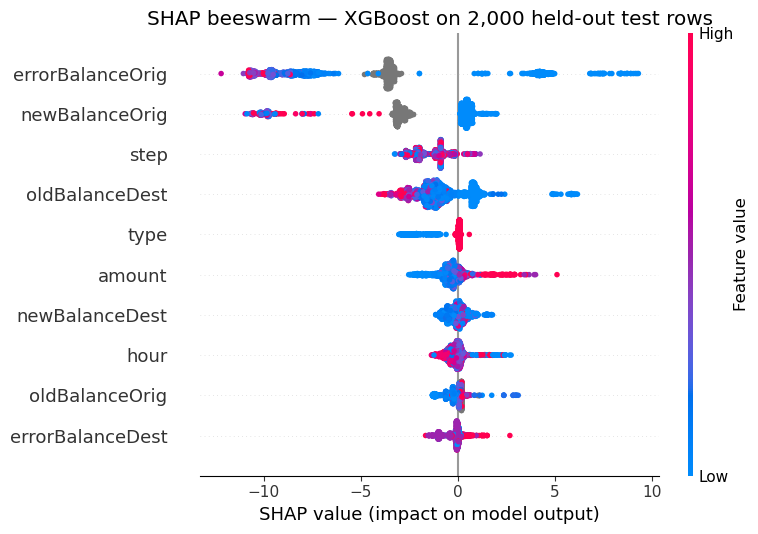

# Fraud-Detection-System

> Mobile-money fraud classifier on PaySim, a simulator whose fraud is near-deterministic once these features are engineered, so read the scores as evaluation practice rather than as production performance: XGBoost at 99.85% precision and 99.56% recall on a 132K time-based holdout, validated across 4 walk-forward folds (PR-AUC 0.9986 ± 0.0013), with tuned hyperparameters, drift monitoring, feature-importance/threshold diagnostics, and a live dashboard.

[](LICENSE)
[](https://www.python.org/)
[](https://xgboost.readthedocs.io/)
[](#results)
[](#calibration)
[](https://github.com/alvenyuka/Fraud-Detection-System/actions/workflows/ci.yml)


## 🔴 Live

**[fraud-detection-alven.vercel.app](https://fraud-detection-alven.vercel.app)**: case-study page with the full build-up, verified results, charts, and a live "Score a transaction" form. The scoring form runs the shipped model, re-implemented in pure Python (see `src/export_model_json.py` and `api/score.py`) so the demo is always on with no cold start. `tests/test_export_parity.py` scores 20,000 fixed-seed transactions through both that port and the committed model and asserts the agreement, which is measured at a worst case of about 1.9e-06 in absolute probability and a mean of about 6e-10.

**[Full dashboard](https://fraud-detection-system-kmeuq7hku8tglnxdpmalfk.streamlit.app/)**: the walk-forward results, feature-importance charts, batch CSV scoring, and drift-monitoring timeline, plus a SHAP waterfall for each score. Runs on a free-tier host and may take ~20-30s to wake up on first load. See "How this was built" below for what each tab is backed by.

### Dashboard Preview

| Tab | What it shows |
|---|---|
| 🔍 Score a Transaction | Fill in one transaction, get a fraud probability, a flag/no-flag verdict, a SHAP waterfall for *why*, and a contextual warning when the score is driven by a full-balance drain (see Step 6 below). |
| 📊 Model Performance | Walk-forward validation metrics, PR and calibration curves, feature-importance bar chart, predicted-probability distribution (fraud vs. legitimate), and an interactive threshold slider showing precision/recall/cost at any cutoff (all from `src/explain.py`, Step 7). |
| 📁 Batch Scoring | Upload a CSV, get every row scored with live KPI cards (total transactions, fraud rate, high-risk alerts, average amount) and flagged rows highlighted in the results table. |
| 📈 Monitoring | PSI drift-over-time chart per engineered feature, against moderate/significant-shift reference lines. |

*(Screenshots aren't checked into the repo. Open the live link above to see it running against the PaySim data.)*

## Why?

Mobile-money fraud is mostly a precision problem. The PaySim dataset has a 0.13% positive rate, so a model that says "not fraud" every time scores 99.87% accuracy while catching zero fraud. Production fraud-ops workflows freeze customer funds on a flag, so false positives carry direct trust and regulatory cost. This repo reports precision on a strict time-based holdout, with no row of the training window drawn from after the test window: 99.85% on the single holdout, and 95.6% on average across four walk-forward folds (lowest fold 87.3%). The holdout has a 2.08% fraud rate, about 16 times the dataset's 0.13% overall rate, so precision at production prevalence would be lower. Two caveats on the walk-forward number specifically, both spelled out in the walk-forward section below: the committed fold metrics were produced before a threshold-selection fix and are optimistic, and two of the four folds run on windows the hyperparameters were tuned on.

> **A note on PaySim.** PaySim is a simulator, not a sample of real traffic, and it is widely used in introductory fraud-detection tutorials, so it's a common choice. What this repo adds is the evaluation rigour: strict time-based split, calibrated probabilities, cost-sensitive threshold selection, and a five-model comparison on identical feature pipelines.

## How this was built

This project was built up in stages, each one answering a question the previous stage left open:

| Step | File | What it establishes |
|---|---|---|
| 1. Baseline model | [`src/train.py`](src/train.py) | Whether a model can separate fraud from legitimate transactions at all |
| 2. Hyperparameter tuning | [`src/tune.py`](src/tune.py) | Whether the default settings were ever tested against alternatives, or just left as-is |
| 3. Walk-forward validation | [`src/validate.py`](src/validate.py) | Whether the model holds up on more than one train/test split |
| 4. Drift monitoring | [`src/monitoring.py`](src/monitoring.py) | How the model's inputs get tracked for drift once it's in production |
| 5. Live dashboard | [`dashboard/app.py`](dashboard/app.py) | How someone without Python can actually use this |
| 6. Feature fix | [`src/features.py`](src/features.py) | What live-testing the dashboard turned up: the model was flagging legitimate account closures as 100% fraud, why that happened, and how it was fixed |
| 7. Diagnostics | [`src/explain.py`](src/explain.py) | Whether one feature dominates the model's decisions, and where the precision/recall/cost trade-off sits as the threshold moves |

**Step 6 in detail:** the model used to take the raw balance columns (`oldbalanceOrg`, `newbalanceOrig`, etc.) as direct inputs alongside the engineered discrepancy features. Because PaySim's simulated fraud almost always drains the sender's account to exactly zero, the model learned "balance hits zero" as a fraud signal on its own: a $12 transaction that fully and correctly emptied a $12 account scored 100% fraud probability, even with zero actual accounting discrepancy. The raw balance columns were removed from the model's inputs (see `MODEL_CARD.md` § Feature Engineering).

Re-testing after applying that fix showed it was only partial. `orig_drain_ratio` (`amount / oldbalanceOrg`) still encodes "was the account fully drained" without needing the raw columns. `src/scenarios.py` reproduces this from the committed model, and writes `dashboard/data/scenario_table.json`, so the numbers below can be regenerated with `make scenarios` and no dataset. On a TRANSFER out of a 10,000 account into a recipient holding 2,000 beforehand, with the recipient credited in full every time:

| Share of the sender's balance moved | Fraud probability |
|---|---|
| 10% / 25% / 50% / 75% / 90% / 99% | between 0.0006% and 0.0061% |
| 100% | 76.00% |

A step function at exactly 100%, with four orders of magnitude between the last partial drain and the full one. That is PaySim's fraud-generation process showing through the data, not a bug in the feature list. The recipient's opening balance moves these numbers, which is why it is stated: the same full drain with nothing credited to the recipient scores 94.77%. See `MODEL_CARD.md` § Feature Engineering for the full breakdown and why fixing it further would mean retraining on transaction data from a real payment system, rather than removing more columns.

## Project Structure

```
Fraud-Detection-System/
├── src/
│   ├── features.py       # Shared feature engineering (used by every script below)
│   ├── train.py           # Step 1: baseline model
│   ├── tune.py             # Step 2: hyperparameter search
│   ├── validate.py         # Step 3: walk-forward validation
│   ├── monitoring.py       # Step 4: drift monitoring
│   ├── explain.py          # Step 7: feature importance / probability spread / threshold curve
│   ├── scenarios.py        # Regenerates MODEL_CARD's scenario tables from the shipped model
│   ├── export_model_json.py  # Dumps the trained model to plain JSON for api/score.py
│   └── predict.py          # Command-line scoring
├── tests/
│   ├── test_features.py             # Accounting identity + cost-sensitive threshold
│   ├── test_export_parity.py        # api/score.py's port against the shipped model
│   └── test_split_and_monitoring.py # Leakage guard + PSI drift
├── api/
│   └── score.py           # Pure-Python model port for the live Vercel demo
├── dashboard/
│   ├── app.py             # Step 5: live Streamlit dashboard
│   ├── requirements.txt   # Lean dependency set for Streamlit Cloud deployment
│   └── data/               # Small precomputed results the dashboard reads
├── model/
│   ├── xgb_fraud_model.pkl   # Trained model (run make train)
│   ├── best_params.json      # Tuned hyperparameters (run make tune)
│   └── model_export.json     # Dependency-free export used by api/score.py
├── .github/workflows/ci.yml   # Runs the tests on every push
├── Fraud Detection System.ipynb
├── conftest.py             # Puts src/ on sys.path for the tests
├── pytest.ini
├── requirements.txt
├── Makefile
├── MODEL_CARD.md
└── LICENSE
```

## Quick Start

```bash
git clone https://github.com/alvenyuka/Fraud-Detection-System.git
cd Fraud-Detection-System

python -m venv .venv
source .venv/bin/activate
pip install -r requirements.txt

make test   # runs in seconds, needs neither the dataset nor a trained model

make train DATA=PS_20174392719_1491204439457_log.csv
make predict

# Optional: the rest of the build-up (see "How this was built" above)
make tune      # search hyperparameters, then re-run `make train` to use them
make validate  # walk-forward validation across 4 time-based folds
make monitor   # simulated drift monitoring
make dashboard # launch the live dashboard locally
```

**What each step costs.** `make test` needs nothing but the repo. Everything
below it needs the 470MB PaySim CSV, and the notebook is the heavy one:

| Step | Needs the dataset | Rough cost |
|---|---|---|
| `make test` | no | seconds |
| `make train` | yes | a few minutes |
| `make validate` | yes | longer, four walk-forward folds |
| the notebook, end to end | yes | 45 to 90 minutes, and roughly 6 to 8GB of free memory |

The notebook is heavier than the pipeline because it fits five models rather
than one, including a stacking ensemble that refits three base learners across
three cross-validation folds. Thread counts are bounded by `N_JOBS` in the
config cell for that reason: `n_jobs=-1` nests inside the stack, and each
worker takes its own copy of a 2.6-million-row frame, so the peak is set by how
many are alive at once rather than by the data. Raise `N_JOBS` if you have the
headroom.

## Features

- XGBoost calibrated to Brier score 0.00017 (vs. random baseline ~0.0204), calibrated on a held-out slice of the training period, not on the same rows the base model was fit on
- 99.85% precision / 99.56% recall at operating threshold 0.4000, tuned hyperparameters (`src/tune.py`), threshold picked dynamically by cost (see `src/features.py::pick_best_threshold`) rather than hardcoded
- Walk-forward validated across 4 time-based folds, not just one split (`src/validate.py`)
- Simulated drift monitoring via PSI (`src/monitoring.py`)
- Feature importance, probability spread, and threshold/cost trade-off diagnostics (`src/explain.py`)
- Live dashboard for scoring, performance review, batch scoring, and monitoring (`dashboard/app.py`)
- Time-based train/test split at step 490, so no training row comes from after the test window
- Balance-discrepancy feature engineering. One feature does dominate: `orig_balance_discrepancy` carries 43.31% of mean |SHAP| attribution, and with `orig_drain_ratio` at 31.43% the two sender-side features carry 74.7% between them (`dashboard/data/feature_importance.json`)
- SHAP attribution (2,000-row representative sample; stable across seeds)
- Five-model comparison on identical feature pipelines
- Inference script `src/predict.py`: scores a transaction or full CSV
- Always-on live scoring demo (`api/score.py`), a pure-Python port whose agreement with the real model is enforced by a test rather than asserted in prose

## Tech Stack

| Layer | Tools |
|---|---|
| Language | Python 3.10+ |
| Modelling | `scikit-learn`, `xgboost`, `lightgbm`, `imbalanced-learn` |
| Explainability | `shap` |
| Serialisation | `joblib` |
| Testing | `pytest`, GitHub Actions |
| Environment | `jupyter`, `jupyterlab` |

## Installation

```bash
git clone https://github.com/alvenyuka/Fraud-Detection-System.git
cd Fraud-Detection-System
python -m venv .venv && source .venv/bin/activate
pip install -r requirements.txt
```

Download PaySim from [Kaggle](https://www.kaggle.com/datasets/ealaxi/paysim1) and place `PS_20174392719_1491204439457_log.csv` in the project root.

## Usage

```bash
jupyter lab "Fraud Detection System.ipynb"   # full notebook
make train                                    # train + serialise model
make predict                                  # score one transaction (interactive)
make predict-csv INPUT=txns.csv OUTPUT=out.csv
```

## Dataset

| Property | Value |
|---|---|
| Rows | 6,362,620 |
| Fraud rate | 0.1291% |
| Active fraud types | TRANSFER, CASH_OUT only |
| Filtered dataset | 2,770,409 rows |

## Methodology

**Time-based split at step 490.** No random shuffling.

| Split | Steps | Rows | Fraud rate |
|---|---|---|---|
| Train | 1-490 | 2,638,273 | 0.207% |
| Test | 491-743 | 132,136 | 2.084% |

**PR-AUC is the primary metric.** Accuracy and ROC-AUC are misleading at 0.13% positive rate.




## Results

**These numbers are the verified output of `src/train.py`, run end-to-end against the full PaySim CSV**, not carried over from the notebook. The script previously couldn't run at all (`CalibratedClassifierCV(..., cv="prefit")` was removed in scikit-learn ≥1.6, and the shipped `model/` directory only ever contained a `.gitkeep`), so the numbers that were here before were never actually produced by this pipeline. Fixed by wrapping the fitted XGBoost model in `sklearn.frozen.FrozenEstimator` and calibrating on a held-out 20% slice of the training period instead of on the same rows the base model was fit on.

| Metric | Value |
|---|---|
| Precision | **99.85%** |
| Recall | **99.56%** |
| F1 | 0.9971 |
| PR-AUC | 0.9993 |
| ROC-AUC | 0.9998 |
| Brier score | 0.00017 |
| Operating threshold | 0.4000 |

*(These are the numbers from the current shipped model: tuned hyperparameters from `src/tune.py`, raw balance columns removed per Step 6 below, and the operating threshold picked dynamically on the calibration split by `src/features.py::pick_best_threshold` rather than hardcoded. Precision and recall both moved after Step 6's fix, see the walk-forward section below for the full trade-off, and `MODEL_CARD.md` for why a near-1.0 PR-AUC on PaySim isn't evidence this generalises to transaction data from a real payment system.)*

### Walk-forward validation: does it hold up on more than one split?

The single-split numbers above only prove the model worked once. `src/validate.py` (Step 3 of the build-up) repeats the same train → calibrate → test recipe on 4 expanding-window folds spanning the entire dataset (steps 350→450, 450→550, 550→650, 650→743), each picking its own cost-optimal threshold:

| Metric | Mean across 4 folds | Std dev |
|---|---|---|
| PR-AUC | 0.9986 | ± 0.0013 |
| ROC-AUC | 0.9999 | ± 0.0002 |
| Precision | 0.9561 | ± 0.0490 |
| Recall | 0.9998 | ± 0.0004 |
| F1 | 0.9768 | ± 0.0262 |
| Brier score | 0.0002 | ± 0.0001 |

**Read the bottom three rows of that table with two corrections in mind.**

**One: Precision, Recall and F1 above are optimistic, and the code that made them has since been fixed.** The version of `src/validate.py` that produced these artifacts passed the *test* fold's own labels to `pick_best_threshold`, so each fold's cutoff was chosen to minimise cost against the very labels the metrics were then reported on. Under the 100-to-1 missed-fraud-to-false-alarm cost that pushes recall to 1.0 almost by construction, which is why three of the four folds report recall of exactly 1.0 and the fourth reports 0.9991. `src/train.py` had the rule right all along and says so in its own comment; `validate.py` did not follow it. It now picks the threshold on the calibration split, like `train.py`. Regenerating these numbers needs the 470MB PaySim CSV, which is not in the repo, so the table above is still the pre-fix output and is labelled as such rather than quietly left alone. Expect precision and F1 to fall and their spread to widen when it is re-run. PR-AUC, ROC-AUC and Brier are threshold-free and are unaffected by any of this.

**Two: folds 1 and 2 are not clean of the hyperparameter search.** `src/tune.py` scored its Optuna trials on the windows 251-350, 351-450 and 451-550. Walk-forward folds 1 and 2 test on 351-450 and 451-550, which are the same two windows, so the hyperparameters those folds run with were selected to do well on exactly those rows. Folds 3 and 4 (551-650, 651-743) are clean. `train.py`'s own test set overlaps the third tuning window on steps 491-550 as well, about a quarter of its test rows. The fix is to move every tuning window below step 350 and re-tune, which again needs the dataset.

What survives both corrections: PR-AUC of 0.9986 ± 0.0013 and ROC-AUC of 0.9999 ± 0.0002 across the four folds, with the weakest fold at 0.9964, which is genuine evidence of ranking stability over time rather than a one-off lucky split. It is also consistent with PaySim's fraud signal being near-deterministic once these features are engineered, which is the more likely explanation of a number that high. The earlier claim that recall's stability was itself evidence against leakage was circular, and it is gone.

The standard deviations use `np.std`'s default population estimator on four folds. The sample estimator would give 0.0566 for precision and 0.0303 for F1, about 15% wider. On four folds a spread of any kind is weak evidence, so the per-fold values in `dashboard/data/walk_forward_results.csv` are the more useful thing to read.

*(These numbers are from the corrected model, see "How this was built" § Step 6 above. Precision dropped from 0.9954 to 0.9561 and its fold-to-fold variance grew after removing the raw balance columns that used to let the model take a shortcut; recall improved slightly. That's the cost of no longer letting the model key off "balance hits zero": a small trade-off for a model that no longer calls legitimate account closures certain fraud.)*

The cost-optimal decision threshold still swings a lot fold to fold, which the near-perfect PR-AUC hides: this dataset's fraud rate and cost trade-off shift enough between windows that no single fixed threshold is clearly "correct" for all of them. The shipped model still uses one static threshold (see `MODEL_CARD.md` → Limitations). A deployment running this in production would need to revisit that threshold periodically rather than set it once.

### Exploratory model comparison (from the notebook, not the shipped pipeline)

| Model | PR-AUC | ROC-AUC | Recall @ 99% Precision |
|---|---|---|---|
| Random Forest | 1.0000 | 1.0000 | 1.0000 |
| Stacking Ensemble | 1.0000 | 1.0000 | 1.0000 |
| XGBoost | 0.9987 | 1.0000 | 0.9688 |
| Logistic Regression | 0.7905 | 0.9796 | 0.4506 |
| LightGBM (default) | 0.2451 | 0.9502 | 0.0000 |

XGBoost was carried forward into `src/train.py` as the shipped model. It didn't top this table (Random Forest and Stacking did, at a suspicious literal 1.0000 across every metric). It was chosen because a single well-understood tree model is easier to justify to a risk team than an ensemble that looks too good to be true. *LightGBM = 0.2451 here uses `scale_pos_weight` but otherwise-default `num_leaves=31`, which overfits badly on this dataset's ~5,500 training-period fraud rows. The same failure mode fixed for XGBoost above (regularize hard enough to match the size of the positive class, rather than the size of the dataset) would likely fix this too, but wasn't re-run for this pass.*



SHAP values on a 2,000-row stratified sample (stable across seeds):



## Known Limitations

PaySim is a simulator. The near-1.0 PR-AUC above comes from how deterministic its fraud-generation process becomes once these features are engineered, so it isn't evidence this generalises to production traffic (see `MODEL_CARD.md`). The drain-ratio artifact described in "How this was built" is only partially fixed: `orig_drain_ratio` still leaks the "fully-drained account" fraud signature, and closing that gap fully would mean retraining on transaction data from a real payment system rather than dropping more columns. The shipped model also uses one static decision threshold, even though the cost-optimal threshold swings meaningfully fold to fold in walk-forward validation, so a production deployment would need to revisit it periodically.

Four more, each of which changes how a number above should be read:

- **This is a sender-side full-drain detector, not a general fraud detector.** `dest_balance_discrepancy` carries 4.06% of SHAP attribution, so the model barely reacts to whether the recipient actually received the money: the same full drain scores 94.77% whether 0%, 25%, 50% or 75% of the debited amount arrives (`make scenarios`). A fraud that skims half an account without draining it, with nothing reaching the recipient, scores 0.0061%. `MODEL_CARD.md` has the full sweep and the rule-based fix that was tried and rejected.
- **The committed walk-forward Precision, Recall and F1 predate a fix to how the threshold is chosen**, and two of the four folds sit on hyperparameter-tuning windows. Both are set out under walk-forward validation above.
- **One of the model's five inputs has drifted heavily over the period it is scored on.** `src/monitoring.py` reports PSI of 1.4163 for `dest_balance_discrepancy`, 5.7 times the 0.25 "investigate" line, past that line in 14 of 15 windows, with a median of 0.79. `orig_drain_ratio` reaches 0.7813 in the final window. The shipped model trains on steps 1 to 490 and runs one static threshold, so this is a real finding about it, not a demonstration of the monitoring code. The walk-forward folds retrain on everything up to each split and so never feel that drift.
- **The headline numbers are not reproducible on a machine with a different core count.** `DEFAULT_XGB_PARAMS` sets `n_jobs: -1` and `model/best_params.json` sets `subsample` to 0.84. XGBoost draws its row-subsample mask from per-thread RNG streams, so with row subsampling below 1.0 the fitted model depends on how many threads it ran with, regardless of `random_state`. Measured on a 60,000-row synthetic frame with `random_state=42` fixed: one thread against four agrees bit for bit at `subsample=1.0`, with or without column subsampling, and diverges by up to 0.093 in predicted probability at `subsample=0.84`. Row subsampling is the trigger; column subsampling is not. So `make train` and `make tune` elsewhere will not return exactly 99.85% / 99.56%. Pinning `n_jobs` to a fixed integer would make future runs reproducible, though not reproduce the committed model, which was trained before this was known.

## Tests

```bash
make test        # or: python -m pytest
```

28 tests, about a minute and a half, run in CI on Python 3.11 and 3.13 on every
push. None needs the 470MB PaySim CSV: each one builds a small frame by hand or
from a fixed seed. That is deliberate. The point is not to re-check the model's
score, which a walk-forward run already reports, but to pin the pieces of logic
that can break silently and still leave every downstream number looking
plausible. The parity test does load the committed model artifacts, which is
what makes it the slow one.

| What is tested | Why it is the thing that can break silently |
|---|---|
| **The time-based split** (`time_based_split`) | Fraud data is temporal. A random split lets the model see later transactions from accounts it is later asked to score, which inflates every metric downstream, and nothing downstream can tell a leaked score from an earned one. One test asserts the training window ends strictly before the test window begins; another shuffles the same frame to demonstrate the overlap the guard prevents. |
| **The accounting identity** (`engineer_features`) | The balance-discrepancy features come from arithmetic, not from learning, so they can be asserted exactly rather than approximately. A clean transaction must score zero on both sides; a drained-origin transaction must break the identity by exactly the amount. Zero balances are checked separately, because an `inf` or `NaN` from a zero denominator would quietly become a category of its own inside the model. |
| **The cost-sensitive threshold** (`pick_best_threshold`) | A model that ranks perfectly and cuts at the wrong threshold still loses money. The test sweeps its own independent grid of cutoffs, rather than the candidate set the implementation builds, and asserts none beats the one returned; a second test pins the 100-to-1 cost ratio that makes the optimiser choose a threshold well below 0.5. |
| **PSI drift** (`calculate_psi`) | PSI is the number that decides whether the model has gone stale in production, so it is asserted to be zero on identical samples, to grow monotonically as a distribution shifts, and to stay finite on a constant feature rather than raising and stopping the whole monitoring run. |
| **The pure-Python port** (`api/score.py`) | The live demo re-implements tree traversal and isotonic calibration by hand, with no xgboost and no scikit-learn, so a wrong default-branch rule or an off-by-one in the isotonic scan would change scores without raising anything and the demo would keep serving plausible numbers. The test scores 20,000 fixed-seed transactions through both paths and asserts a bound it measures rather than one quoted from memory. |

`FEATURE_COLS` membership is also pinned by name, and the raw balance columns are
asserted absent. The test that iterates the list would otherwise delete its own
coverage the moment an entry was removed, and the raw balances are exactly the
shortcut Step 6 removed.

Training, tuning, walk-forward validation and drift monitoring all need the
dataset, so they stay local steps behind the Makefile rather than running in CI.

## Roadmap

- [x] Time-based evaluation harness
- [x] Five-model comparison
- [x] Calibration + SHAP attribution
- [x] Inference script (`src/predict.py`)
- [x] Training pipeline (`src/train.py`)
- [x] Model card (`MODEL_CARD.md`)
- [x] Hyperparameter tuning (`src/tune.py`)
- [x] Walk-forward validation across multiple time splits (`src/validate.py`)
- [x] Drift monitoring (PSI on balance-discrepancy features, `src/monitoring.py`)
- [x] Live dashboard (`dashboard/app.py`)
- [x] Feature-importance / threshold-cost diagnostics (`src/explain.py`)
- [x] Always-on live scoring demo (`api/score.py`, `src/export_model_json.py`)
- [x] Unit tests on the leakage guard, the accounting identity, the threshold search and PSI, run in CI (`tests/`)
- [ ] Streaming inference (Kafka + FastAPI)

## License

MIT. See [`LICENSE`](LICENSE).

## Credits

Dataset: Lopez-Rojas, E. A., Elmir, A., & Axelsson, S. (2016). *PaySim: A financial mobile money simulator for fraud detection.*
Built by **Alven Yuka**, CPA Finalist.

The single-split results above are the verified output of re-running `src/train.py` end-to-end against the full PaySim dataset; see Results for the case where that check caught numbers the shipped pipeline had never actually produced, and the walk-forward section for the two numbers there that are still labelled optimistic.

## Connect

📫 [alvenyuka2@gmail.com](mailto:alvenyuka2@gmail.com) · 💼 [LinkedIn](https://www.linkedin.com/in/alven-yuka-610b78174/) · 🐙 [GitHub](https://github.com/alvenyuka)
