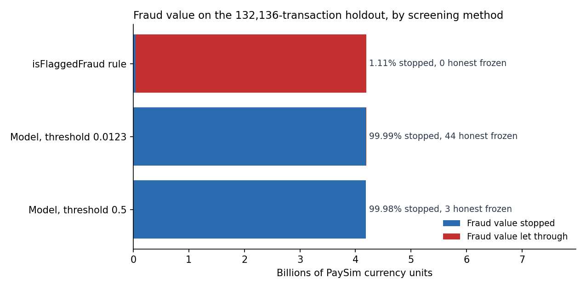
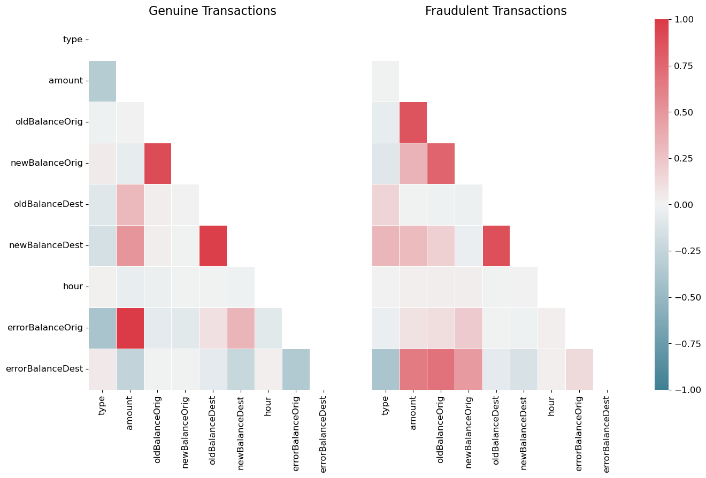
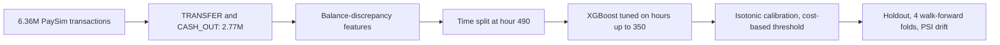
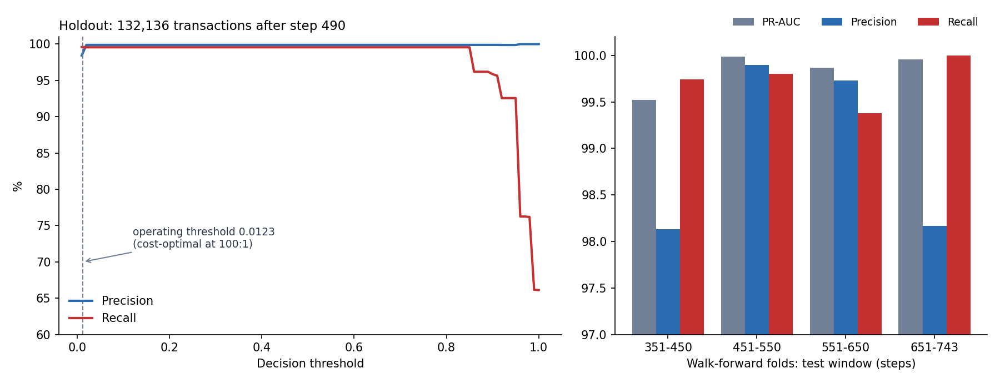

# Fraud Detection System

A model that flags fraudulent mobile-money transfers so they can be stopped before the money leaves. On 132,136
transactions it had never seen, it **stopped 99.99% of the fraud value** (the simulator's built-in rule stopped
1.1%), catching **2,743 of 2,754 frauds** while wrongly flagging 44 legitimate ones. XGBoost trained on 6.3
million simulated PaySim transactions, with a live scoring demo.

[](LICENSE)
[](https://www.python.org/)
[](https://github.com/alvenyuka/Fraud-Detection-System/actions/workflows/ci.yml)



**Try it:** [live scoring page](https://fraud-detection-alven.vercel.app) · [dashboard](https://fraud-detection-system-kmeuq7hku8tglnxdpmalfk.streamlit.app/) (free host, allow about 30 seconds to wake)

## Contents

1. [Business problem](#business-problem)
2. [Dataset](#dataset)
3. [Methodology](#methodology)
4. [Results](#results)
5. [Business impact](#business-impact)
6. [Key insights](#key-insights)
7. [Limitations](#limitations)
8. [Repository structure](#repository-structure)
9. [How to run](#how-to-run)

## Business problem

In mobile money a fraud flag usually freezes the customer's funds. Every false alarm locks an honest customer
out of their own money, which costs trust and invites regulatory complaints; every missed fraud is a direct
loss. Fraud is about 0.13% of transactions, so a model that never flags anything is 99.87% accurate and
useless.

A fraud-operations team therefore needs three things from a model: how much fraud value it stops, how many
honest customers it freezes to do so, and whether that holds up as time passes. This project measures all
three on data the model has never seen.

## Dataset

[PaySim](https://www.kaggle.com/datasets/ealaxi/paysim1) (Lopez-Rojas, Elmir and Axelsson, 2016): a mobile-money
simulator calibrated on logs from an African mobile-money service, one row per transaction, one step per
simulated hour.

| Property | Value |
|---|---:|
| Transactions | 6,362,620 |
| Fraud rate, all transactions | 0.13% |
| TRANSFER and CASH_OUT (the only types with fraud) | 2,770,409 |
| Training period, steps 1 to 490 | 2,638,273 (0.21% fraud) |
| Holdout, steps 491 to 743 | 132,136 (2,754 frauds, 2.08%) |



## Methodology


```mermaid
flowchart LR
    A[6.36M PaySim transactions] --> B[TRANSFER and CASH_OUT: 2.77M]
    B --> C[Balance-discrepancy features]
    C --> D[Time split at hour 490]
    D --> E[XGBoost tuned on hours up to 350]
    E --> F[Isotonic calibration, cost-based threshold]
    F --> G[Holdout, 4 walk-forward folds, PSI drift]
```

1. **Accounting features.** For each transaction, check whether the sender's and recipient's balances move by
   exactly the amount sent, and how much of the sender's balance the transfer drains. Fraud breaks the
   identity. The raw balance columns are left out (see Key insights).
2. **No look-ahead.** Training data precedes test data. Hyperparameters are tuned with Optuna (40 trials) only
   on windows ending by hour 350, before every reporting window.
3. **Calibration and a cost-based cut-off.** Isotonic calibration on a held-out slice of the training period,
   then the threshold that minimises cost with a missed fraud priced at 100 times a false alarm.
4. **Validation over time.** The holdout, plus four expanding-window folds testing hours 351 to 743, each
   choosing its threshold on calibration data, never on test rows.
5. **Monitoring.** Population Stability Index for each input across 15 time windows, and SHAP explanations for
   every score in the dashboard.

## Results

| Measure (holdout) | Result |
|---|---:|
| Frauds caught (recall) | **2,743 of 2,754, 99.6%** |
| Flags that were fraud (precision) | **98.4%**, 44 false alarms |
| PR-AUC | 0.9996 |
| Brier score (calibration) | 0.000138 |
| Walk-forward PR-AUC, 4 later windows | 0.9983 ± 0.0019 |
| Walk-forward precision / recall | 99.0% / 99.7% |



## Business impact

Value of fraud on the holdout, in PaySim's simulated currency units, where a fraud's value is its transaction
amount (`src/business_impact.py`).

| Screening | Fraud value stopped | Fraud value let through | Honest customers frozen |
|---|---:|---:|---:|
| None | 0 | 4.19 bn | 0 |
| PaySim's `isFlaggedFraud` rule | 46.5 M (1.1%) | 4.14 bn | 0 |
| **Model, threshold 0.0123 (cost-optimal)** | **4.190 bn (99.99%)** | 0.40 M | 44 |
| Model, threshold 0.5 | 4.190 bn (99.98%) | 0.75 M | 3 |

The model stops 90 times as much fraud value as the built-in rule. The threshold is the business decision: the
cost-optimal cut-off catches one more fraud (worth 0.35 M) than a 0.5 cut-off, at the price of freezing 41
more honest customers. If a wrongly frozen account costs the operator more than about $24 in support,
compensation and churn, the stricter threshold is the better choice.

## Key insights

- **Fraud here has one signature: the sender's account is drained to zero.** The two sender-side features
  carry 63% of the model's SHAP attribution, and a fraud that skims part of an account scores close to zero.
- **Testing the live demo exposed a costly error, which was fixed.** An earlier model flagged a customer
  emptying their own $12 account as certain fraud, because it had learned "balance hits zero" from the raw
  balance columns. Removing those inputs stopped it.
- **The class weight is a hyperparameter, not the class ratio.** Weighting fraud by the raw ratio (336) made a
  simple XGBoost fail on later data (PR-AUC 0.48 in the notebook); tuning on earlier data chose 2.14.
- **The cut-off drifts.** The cost-optimal threshold ranged from 0.017 to 0.89 across the walk-forward folds,
  and one input's PSI reached 1.42, so a deployment would review the threshold on a schedule.

## Limitations

- **PaySim is a simulator.** Once these features exist its fraud is almost deterministic, which is why the
  scores are so high. They show the evaluation method, not the accuracy to expect on a real network.
- **The holdout is fraud-heavy** (2.1% against 0.13% overall), so precision at real prevalence would be lower.
- **Full-drain fraud only.** Partial-skim fraud is not detected; a rule-based patch was tested and rejected
  because it multiplied false alarms on the training period (see the model card).
- **Money figures are simulated units**, and the cost of a false alarm is an assumption, not a measurement.

## Repository structure

```
src/            features, tuning, training, walk-forward validation, monitoring, SHAP, scenarios,
                business_impact.py (value stopped by each screen), make_figures.py
api/score.py    pure-Python port of the model behind the live demo, parity-tested
dashboard/      Streamlit dashboard and the precomputed results it reads
model/          trained model, tuned settings, JSON export
tests/          31 tests: time split, accounting identity, threshold search, PSI, port parity, impact
MODEL_CARD.md   intended use, evaluation, limitations
Fraud Detection System.ipynb   exploratory five-model comparison
```

## How to run

```bash
pip install -r requirements.txt
make test        # 31 tests, no dataset needed
# download PaySim from Kaggle into the project root, then:
make tune        # 40 Optuna trials, about 50 minutes
make train       # train and save the model, a few minutes
make validate    # four walk-forward folds
python src/business_impact.py --data PS_20174392719_1491204439457_log.csv
make figures     # redraw the README charts
```

## Documentation

The full method, the tuning and walk-forward details, drift findings and the tests are in
[`docs/METHODOLOGY.md`](docs/METHODOLOGY.md); intended use and risks are in [`MODEL_CARD.md`](MODEL_CARD.md).

## License

MIT. See [`LICENSE`](LICENSE). Data: Lopez-Rojas, Elmir and Axelsson (2016), *PaySim: A financial mobile money simulator for fraud detection* ([Kaggle](https://www.kaggle.com/datasets/ealaxi/paysim1)).

Alven Yuka · [LinkedIn](https://www.linkedin.com/in/alven-yuka-610b78174/) · [Email](mailto:alvenyuka2@gmail.com)
