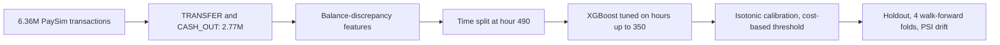

# Fraud Detection System

An XGBoost fraud classifier for mobile-money transfers, trained on 6.3 million PaySim transactions and tested
on a strict time-based holdout. At a cost-based threshold it catches **2,743 of 2,754 frauds (99.6% recall)**
at **98.4% precision**, and a live demo scores transactions in the browser.

[](LICENSE)
[](https://www.python.org/)
[](https://github.com/alvenyuka/Fraud-Detection-System/actions/workflows/ci.yml)


**Try it:** [live scoring page](https://fraud-detection-alven.vercel.app) · [dashboard](https://fraud-detection-system-kmeuq7hku8tglnxdpmalfk.streamlit.app/) (free host, allow about 30 seconds to wake)

## Overview

In mobile money a fraud flag usually freezes the customer's funds, so every false alarm locks an honest
customer out of their own money, and every missed fraud is a direct loss. Fraud is about 0.13% of
transactions here, so a model that never flags anything is 99.87% accurate and useless. The useful questions
are precision and recall at a threshold set by what each mistake costs, and whether they hold over time.

## Results

Holdout: the 132,136 transactions after simulated hour 490 (2,754 frauds, 2.1%).

| Measure | Result |
|---|---:|
| Frauds caught (recall) | **2,743 of 2,754, 99.6%** |
| Flags that were fraud (precision) | **98.4%**, 44 false alarms |
| PR-AUC | 0.9996 |
| Walk-forward PR-AUC, 4 later windows | 0.9983 ± 0.0019 |
| Walk-forward precision / recall | 99.0% / 99.7% |

- **The threshold is a business decision, and the data shows its price.** Costing a missed fraud at 100 times
  a false alarm puts the cutoff at 0.012. Any cutoff from 0.02 to 0.5 misses one more fraud but raises only 3
  false alarms instead of 44, so if a wrongly frozen account costs more than about $24, the higher threshold
  is the better choice.
- **Fraud here has one signature: the sender's account is drained to zero.** The two sender-side features
  carry 63% of the model's SHAP attribution, and a fraud that skims part of an account scores close to zero.
- **Testing the live demo exposed a costly error, which was fixed.** An earlier model flagged a customer
  emptying their own $12 account as certain fraud, because it had learned "balance hits zero" from the raw
  balance columns. Removing those inputs stopped it.

## Approach


```mermaid
flowchart LR
    A[6.36M PaySim transactions] --> B[TRANSFER and CASH_OUT: 2.77M]
    B --> C[Balance-discrepancy features]
    C --> D[Time split at hour 490]
    D --> E[XGBoost tuned on hours up to 350]
    E --> F[Isotonic calibration, cost-based threshold]
    F --> G[Holdout, 4 walk-forward folds, PSI drift]
```

1. **Accounting features.** For each transaction, check whether the sender's and recipient's balances move by
   exactly the amount sent; fraud breaks that identity.
2. **No look-ahead.** Hyperparameters are tuned only on windows ending by hour 350, before every reporting
   window; thresholds are chosen on a calibration slice, never on test rows.
3. **Calibrated scores and a cost-based cutoff**, rather than a fixed 0.5.
4. **Monitoring.** Population Stability Index tracks drift in each input over time, and SHAP explains each
   score in the dashboard.

## Repository structure

```
src/            features, tuning, training, walk-forward validation, monitoring, SHAP, scenarios
api/score.py    pure-Python port of the model behind the live demo, parity-tested
dashboard/      Streamlit dashboard and the precomputed results it reads
model/          trained model, tuned settings, JSON export
tests/          28 tests: time split, accounting identity, threshold search, PSI, port parity
MODEL_CARD.md   intended use, evaluation, limitations
```

## Getting started

```bash
pip install -r requirements.txt
make test       # 28 tests, no dataset needed
# download PaySim from Kaggle into the project root, then:
make train      # train and save the model, a few minutes
make validate   # four walk-forward folds
make predict    # score a transaction
```

## Notes

- PaySim is a simulator: once these features exist its fraud is almost deterministic, which is why the scores
  are so high. They show the evaluation method, not the accuracy to expect on a real network.
- The holdout is fraud-heavy (2.1% against 0.13% overall), so precision at real prevalence would be lower.
- The cost-optimal threshold moves between time windows (0.017 to 0.89 across the folds), so a deployment
  would need to review it on a schedule.

## Documentation

The full method, the tuning and walk-forward details, drift findings and the tests are in
[`docs/METHODOLOGY.md`](docs/METHODOLOGY.md); intended use and risks are in [`MODEL_CARD.md`](MODEL_CARD.md).

## License

MIT. See [`LICENSE`](LICENSE). Data: Lopez-Rojas, Elmir and Axelsson (2016), *PaySim: A financial mobile money simulator for fraud detection* ([Kaggle](https://www.kaggle.com/datasets/ealaxi/paysim1)).

Alven Yuka · [LinkedIn](https://www.linkedin.com/in/alven-yuka-610b78174/) · [Email](mailto:alvenyuka2@gmail.com)
